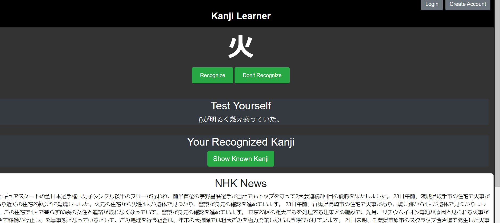

<!-- Improved compatibility of back to top link: See: https://github.com/othneildrew/Best-README-Template/pull/73 -->
<a name="readme-top"></a>
<!--
*** Thanks for checking out the Best-README-Template. If you have a suggestion
*** that would make this better, please fork the repo and create a pull request
*** or simply open an issue with the tag "enhancement".
*** Don't forget to give the project a star!
*** Thanks again! Now go create something AMAZING! :D
-->


<!-- PROJECT SHIELDS -->
<!--
*** I'm using markdown "reference style" links for readability.
*** Reference links are enclosed in brackets [ ] instead of parentheses ( ).
*** See the bottom of this document for the declaration of the reference variables
*** for contributors-url, forks-url, etc. This is an optional, concise syntax you may use.
*** https://www.markdownguide.org/basic-syntax/#reference-style-links
-->
[![Contributors][contributors-shield]][contributors-url]
[![Forks][forks-shield]][forks-url]
[![Stargazers][stars-shield]][stars-url]
[![Issues][issues-shield]][issues-url]
[![LinkedIn][linkedin-shield]][linkedin-url]


<!-- PROJECT LOGO -->
<br />
<div align="center">

<h3 align="center">Kanji Learner</h3>

  <p align="center">
    Kanji App which generates japanese text based off the kanji the user recognizes
    <br />
    <a href="https://github.com/RayFFH/KanjiWebsite/blob/main/readme.md"><strong>Explore the docs »</strong></a>
    <br />
    <br />
    <a href="https://kanjilearner.azurewebsites.net">View Demo</a>
    ·
    <a href="https://github.com/RayFFH/KanjiWebsite/issues">Report Bug</a>
    ·
    <a href="https://github.com/RayFFH/KanjiWebsite/issues">Request Feature</a>
  </p>
</div>


<!-- TABLE OF CONTENTS -->
<details>
  <summary>Table of Contents</summary>
  <ol>
    <li>
      <a href="#about-the-project">About The Project</a>
      <ul>
        <li><a href="#built-with">Built With</a></li>
      </ul>
    </li>
    <li>
      <a href="#getting-started">Getting Started</a>
      <ul>
        <li><a href="#prerequisites">Prerequisites</a></li>
        <li><a href="#installation">Installation</a></li>
      </ul>
    </li>
    <li><a href="#usage">Usage</a></li>
    <li><a href="#roadmap">Roadmap</a></li>
    <li><a href="#contributing">Contributing</a></li>
    <li><a href="#license">License</a></li>
    <li><a href="#contact">Contact</a></li>
    <li><a href="#acknowledgments">Acknowledgments</a></li>
  </ol>
</details>


<!-- ABOUT THE PROJECT -->
## About The Project


<br></br>

There are many learning apps online however most of these apps are focued on a spaced repetition system. I want users to learn through actually engaging with japanese content.
Therefore I made this app that tracks the user's known kanji and extracts text containing 
kanji that the user recognizes

Here's how it works:
* User creates an account and logs in
* Randon kanji are generated and user clicks on whether he recognizes the kanji or not
* Japanese text is then extracted online containing kanji that the user recognizes.


<p align="right">(<a href="#readme-top">back to top</a>)</p>


### Built With

* 
* [![JQuery][JQuery.com]][JQuery-url]
* 
* 
* 
* 
* 
* 
* 


<p align="right">(<a href="#readme-top">back to top</a>)</p>


<!-- GETTING STARTED -->
## Getting Started

To get started all you need to do is click on the link below and create an account and start using the app.
All you date will be saved on an Azure SQL database
https://kanjilearner.azurewebsites.net

If you want to run the code on your own machine make to sure to download the latest verions of node.js and flask
* npm
  ```sh
  npm install npm@latest -g
  ``

### Prerequisites
This app is targeted towards people who already have knowledge of kanji and you'll get the most benefit 
if you already know around 200 kanji

### Installation

1. Clone the repo
   ```sh
   git clone https://github.com/RayFFH/KanjiWebsite.git
   ```
2. Install NPM packages
   ```sh
   npm install
   ```


<p align="right">(<a href="#readme-top">back to top</a>)</p>


<!-- USAGE EXAMPLES -->
## Usage
 ```
app.post('/saveKnownKanji', async (req, res) => {
    try {
        const response = await axios.post('http://localhost:5000/saveKnownKanji', {
            user_id: req.body.user_id,
            kanji: req.body.kanji,
        });
        res.json(response.data);
    } catch (error) {
        console.error('Error saving known kanji:', error);
        res.status(500).json({ error: 'Internal Server Error' });
    }
});
 ```
App Backend works by having expresss.js server to communicate with a flask server.
The data retrieval and SQL queries are done within the flask server

<p align="right">(<a href="#readme-top">back to top</a>)</p>


<!-- ROADMAP -->
## Roadmap

- [x] Hosted and deployed on azure
- [x] Connected to azure SQL databse
- [x] Allows users to login and sign up
- [x] Randomizes kanji
- [x] Allows users to recognise kanji
- [x] Extracts Text containing user's recognised kanji
- [x] Highlight kanji that is known on extracted text
- [ ] Use jissho API for dictionary function
- [ ] Read allowed Kanji for visually impaired users
- [ ] Increase loading speeds on azure website


<p align="right">(<a href="#readme-top">back to top</a>)</p>


<!-- CONTRIBUTING -->
## Contributing

If you have a suggestion that would make this better, please fork the repo and create a pull request. You can also email me at phoenix222smart@gmail.com if you want to discuss more.

1. Fork the Project
2. Create your Feature Branch (`git checkout -b feature`)
3. Commit your Changes (`git commit -m 'Add some Feature'`)
4. Push to the Branch (`git push origin AmazingFeature`)
5. Open a Pull Request

<p align="right">(<a href="#readme-top">back to top</a>)</p>


<!-- CONTACT -->
## Contact

Phoenix Smart - phoenix222smart@gmail.com
Linkedin - https://www.linkedin.com/in/phoenixsmart/


<p align="right">(<a href="#readme-top">back to top</a>)</p>


<!-- ACKNOWLEDGMENTS -->
## Acknowledgments
List of websites i took inspiration from
* Wanikani
* Anki


<p align="right">(<a href="#readme-top">back to top</a>)</p>


<!-- MARKDOWN LINKS & IMAGES -->
<!-- https://www.markdownguide.org/basic-syntax/#reference-style-links -->
[contributors-shield]: https://img.shields.io/github/contributors/RayFFH/KanjiWebsite?style=for-the-badge
[contributors-url]: https://github.com/RayFFH/KanjiWebsite/graphs/contributors/
[forks-shield]: https://img.shields.io/github/forks/RayFFH/KanjiWebsite?style=for-the-badge
[forks-url]: https://github.com/RayFFH/KanjiWebsite/network/members
[stars-shield]: https://img.shields.io/github/stars/RayFFH/KanjiWebsite?style=for-the-badge
[stars-url]: https://github.com/RayFFH/KanjiWebsite/stargazers
[issues-shield]: https://img.shields.io/github/issues/RayFFH/KanjiWebsite.svg?style=for-the-badge
[issues-url]: https://github.com/RayFFH/KanjiWebsite/issues

[linkedin-shield]: https://img.shields.io/badge/-LinkedIn-black.svg?style=for-the-badge&logo=linkedin&colorB=555
[linkedin-url]: https://www.linkedin.com/in/phoenixsmart/
[product-screenshot]: images/screenshot.png
[Next.js]: https://img.shields.io/badge/next.js-000000?style=for-the-badge&logo=nextdotjs&logoColor=white
[Next-url]: https://nextjs.org/
[React.js]: https://img.shields.io/badge/React-20232A?style=for-the-badge&logo=react&logoColor=61DAFB
[React-url]: https://reactjs.org/
[Vue.js]: https://img.shields.io/badge/Vue.js-35495E?style=for-the-badge&logo=vuedotjs&logoColor=4FC08D
[Vue-url]: https://vuejs.org/
[Angular.io]: https://img.shields.io/badge/Angular-DD0031?style=for-the-badge&logo=angular&logoColor=white
[Angular-url]: https://angular.io/
[Svelte.dev]: https://img.shields.io/badge/Svelte-4A4A55?style=for-the-badge&logo=svelte&logoColor=FF3E00
[Svelte-url]: https://svelte.dev/
[Laravel.com]: https://img.shields.io/badge/Laravel-FF2D20?style=for-the-badge&logo=laravel&logoColor=white
[Laravel-url]: https://laravel.com
[Bootstrap.com]: https://img.shields.io/badge/Bootstrap-563D7C?style=for-the-badge&logo=bootstrap&logoColor=white
[Bootstrap-url]: https://getbootstrap.com
[JQuery.com]: https://img.shields.io/badge/jQuery-0769AD?style=for-the-badge&logo=jquery&logoColor=white
[JQuery-url]: https://jquery.com 

 


 


